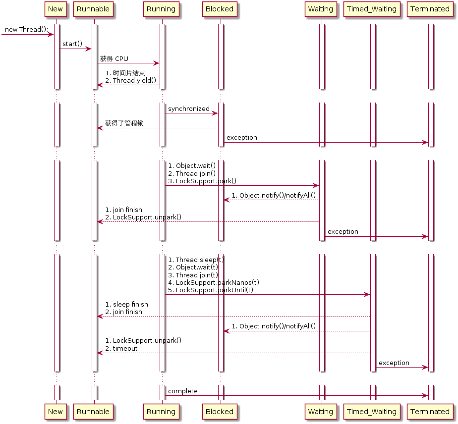
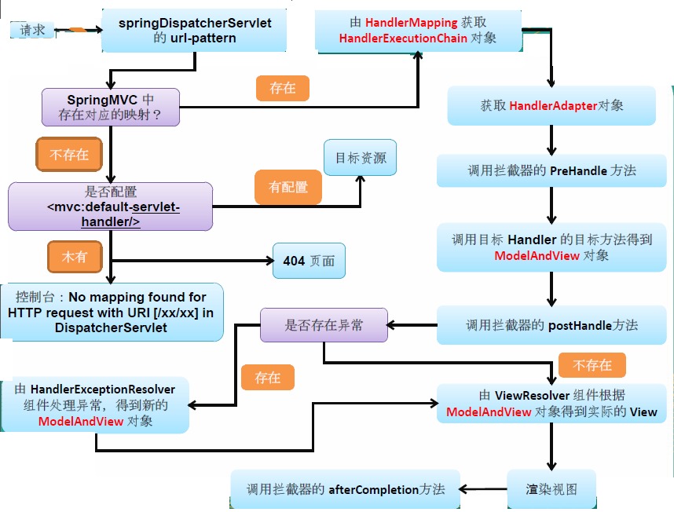
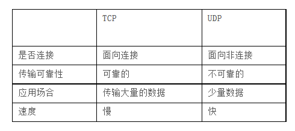
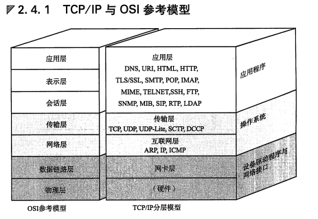

# 阿里二面准备(Java 研发)

感觉有机会进行二面（原谅我没来由的自信，～～），准备一下。参考了牛客网上 30 多个面经帖，这是目前我能找到的几乎所有的问题。私以为如果能全部掌握，基本就能收割 offer 了。时间有限的话，针对自己的情况优先选最有可能被问到的问题来准备。

有少部分内容我直接忽略了，可以参考 `interview/` 目录下之前做的总结。

**注意：因为我并没有系统的学习多线程编程，所以并发相关的问题我只是大概了解一下，目前并不深入讨论(面试时直接说明即可)**

<!-- TOC -->

- [数据结构](#数据结构)
- [算法题（剑指 Offer 上原题不少）](#算法题剑指-offer-上原题不少)
- [Java 基础](#java-基础)
- [Java 高级](#java-高级)
- [三大框架](#三大框架)
- [数据库](#数据库)
- [操作系统](#操作系统)
- [计算机网络](#计算机网络)
- [分布式/集群等高级主题](#分布式集群等高级主题)
- [技术开放题](#技术开放题)
- [题目参考](#题目参考)
- [解答参考](#解答参考)

<!-- /TOC -->

---

## 数据结构

1. HashMap的原理，内部数据结构？
    - 底层使用哈希表（数组 + 链表），当链表过长会将链表转成 红黑树以实现 O(logn) 时间复杂度内查找
1. 讲一下 HashMap 中 put 方法过程？
    1. 对 Key 求 Hash 值，然后再计算 下标。
    1. 如果没有碰撞，直接放入桶中，
    1. 如果碰撞了，以链表的方式链接到后面，
    1. 如果链表长度超过阀值（TREEIFY_THRESHOLD == 8），就把链表转成红黑树。
    1. 如果节点已经存在就替换旧值
    1. 如果桶满了（容量 * 加载因子），就需要 resize。
1. HashMap 中 hash 函数怎么是是实现的？ 还有哪些 hash 的实现方式？
    1. 高 16bit 不变，低 16bit 和高 16bit 做了一个异或
    1. （n - 1） & hash --> 得到下标
    1. 还有哪些 Hash 实现方式：可以参考相关博客
1. HashMap 怎样解决冲突，讲一下扩容过程，假如一个值在原数组中，现在移动了新数组，位置肯定改变了，那是什么定位到在这个值新数组中的位置，
    - 将新节点加到链表后，
    - 容量扩充为原来的两倍，然后对每个节点重新计算哈希值。
    - 这个值只可能在两个地方，一个是原下标的位置，另一种是在下标为 <原下标+原容量> 的位置。
1. 抛开 HashMap，hash 冲突有那些解决办法？
    - 开放定址，链地址法
1. 针对 HashMap 中某个 Entry 链太长，查找的时间复杂度可能达到 O(n)，怎么优化？
    - 将链表转为红黑树， JDK1.8 已经实现了。
1. 数组和 ArrayList 的区别；
    1. 数组可以包含基本类型和对象类型，ArrayList 只能包含对象类型
    1. 数组大小固定，ArrayList 大小可以动态变化
    1. ArrayList 提供了更多的特性（`addAll`、`removeAll`）。
1. Arraylist 如何实现排序
    - `Collections.sort(List<T> list)`;
    - `sort(List<T> list, Comparator<? super T> c)`;
1. HashMap
    1. 数组 + 链表方式存储
    1. 默认容量： 16(2^n 为宜,若定义的初始容量不是 2^n，容量会定义为大于该初始容量的最小 2^n)
        - 例如：初始容量为 13，则真正的容量是 16.
    1. put:
        1. 索引计算 : ((key.hashCode() ^ (key.hashCode() >>> 16)) & (table.length - 1))
        1. 在链表中查找，并记录链表长度，若链表长度达到了 TREEIFY_THRESHOLD(8)，则将该链转成红黑树。
        1. 若在链表中找到了，则替换旧值，若未找到则继续
        1. 当总元素个数超过容量*加载因子时，扩容为原来 2 倍并重新散列
            - (元素的下标要么不变，要么变为【原下标+原容量】)。
        1. 将新元素加到链表尾部
        1. 线程不安全
1. HashTable
    1. 数组 + 链表方式存储
    1. 默认容量： 11(质数 为宜)
    1. put:
        1. 索引计算 : （key.hashCode() & 0x7FFFFFFF）% table.length
        1. 若在链表中找到了，则替换旧值，若未找到则继续
        1. 当总元素个数超过容量*加载因子时，扩容为原来 2 倍并重新散列。
        1. 将新元素加到链表头部
    1. 对修改 Hashtable 内部共享数据的方法添加了 synchronized，保证线程安全。
1. HashMap ，HashTable 区别
    1. 默认容量不同。
    2. 索引计算方式不同。
    3. HashMap 特有的将过长链表转换为红黑树。
    4. 新元素的位置不同。
    5. 线程安全性
1. HashMap、ConcurrentHashMap 区别。
    1. 索引计算消除了最高位的影响
    1. 默认容量： 16(若定义了初始容量(c)，容量会定义为大于(c + (c >>> 1) +1) 的最小 2^n)
        - 例如：初始容量为 13，则真正的容量是 32.
    1. 线程安全，并发性能较好
        - 并发性能好的原因是 ConcurrentHashMap 并不是定义 synchronized 方法，而是在链表头上同步，不同的链表之间是互不影响的。
1. ConcurrentHashMap 原理
    1. 最大特点是引入了 CAS（借助 Unsafe 来实现【native code】）
        1. CAS有3个操作数，内存值V，旧的预期值A，要修改的新值B。当且仅当预期值A和内存值V相同时，将内存值V修改为B，否则什么都不做。
        1. Unsafe 借助 CPU 指令 cmpxchg 来实现
        1. 使用实例：
            1. 对 sizeCtl 的控制都是用 CAS 来实现的
            >1. sizeCtl ：默认为0，用来控制 table 的初始化和扩容操作。
            >    - -1 代表table正在初始化
            >    - N 表示有 -N-1 个线程正在进行扩容操作
            >    - 如果table未初始化，表示table需要初始化的大小。
            >    - 如果table初始化完成，表示table的容量，默认是table大小的0.75倍，居然用这个公式算0.75（n - (n >>> 2)）。
        1. CAS 会出现的问题：ABA
            - 对变量增加一个版本号，每次修改，版本号加 1，比较的时候比较版本号。
1. TreeMap 和 TreeSet 区别和实现原理
    - `TreeSet` 底层是 `TreeMap`，`TreeMap` 是基于红黑树来实现的。
1. 如果想实现一个线程安全的队列，可以怎么实现？
1. 知道 LRU 吗，20分钟基于 HashMap 实现一个 LRU 算法，面试官给个地址，进去写代码，面试官远程看
    - [如何设计实现一个LRU Cache？](http://yikun.github.io/2015/04/03/%E5%A6%82%E4%BD%95%E8%AE%BE%E8%AE%A1%E5%AE%9E%E7%8E%B0%E4%B8%80%E4%B8%AALRU-Cache%EF%BC%9F/)
1. 二叉树的遍历方式，前序、中序、后序和层序
    - 可以再写一篇了。。
1. 常见的排序算法时间复杂度（排序算法实现也要重点掌握）
    - [常见排序算法实现(Java)](../notes/算法.md)
1. 红黑树的特点及相比平衡二叉树的优点（先介绍各自特点）？
    - 红黑树
        1. 每个节点要么是红色，要么是黑色。
        1. 根节点永远是黑色的。
        1. 所有的叶节点都是空节点（即 null），并且是黑色的。
        1. 每个红色节点的两个子节点都是黑色。（从每个叶子到根的路径上不会有两个连续的红色节点）
        1. 从任一节点到其子树中每个叶子节点的路径都包含相同数量的黑色节点。
    - 平衡二叉树
        1. 任何节点的两个儿子子树的高度最大差别为一
    - 红黑树并不追求“完全平衡”——它只要求部分地达到平衡要求，降低了对旋转的要求，从而提高了性能。
1. B+树的了解
    - 多分支结构有效降低了树的高度
    - B 树的各种操作能使 B 树保持较低的高度，从而达到有效避免磁盘过于频繁的查找存取操作，从而有效提高查找效率
1. Trie-Tree 原理及其应用；
    - 字典树
    - 特点
        1. 根节点不包含字符，除根节点外的每一个子节点都包含一个字符。
        1. 从根节点到某一个节点，路径上经过的字符连接起来，为该节点对应的字符串。
        1. 每个节点的所有子节点包含的字符互不相同。
    - 核心思想是空间换时间
    - 应用
        1. 字符串检索
        1. 词频统计

## 算法题（剑指 Offer 上原题不少）

1. 怎么查询一个单向链表的倒数第五个节点
1. 判断链表是否成环
1. 两条相交的单向链表，如何求他们的第一个公共节点
1. 在无序数组中找最大的K个数?
1. 给定n个数，寻找第k小的数，同时给出时间复杂度
1. 找一个数组中的第三大数
1. 找出数组中第一个出现2次的数，
1. 求 1-N 中数字 1 的个数。
1. 判断一个数是不是丑数；
1. 求第 K 个丑数；
1. 10w行数据，每行一个单词，统计出现次数出现最多的前100个。
1. 一个文本文件，给你一个单词，判断单词是否出现。
1. 一进去要求敲代码二叉排序树的插入、删除及查找
1. 某海量用户网站，用户拥有积分，积分可能会在使用过程中随时更新。现在要为该网站设计一种算法，在每次用户登录时显示其当前积分排名。用户最大规模为2 亿；积分为非负整数，且小于 100 万；
1. 判断一棵二叉树是否是 BST。
1. 一副扑克 54 张牌，现在分成 3 份，每份 18 张，问大小王出现在同一份中的概率是多少；
1. 50个白球50个红球，两个盒子，怎么放让人随机在一个盒子里抽到红球概率最高。。。这个就是一个盒子放一个红球，另一个盒子放99个球。
1. logN 查找一个有序数组移动后类似 4 5 6 7 1 2 3里面的一个数
1. 0 ~ n 连续 n + 1 数，现在有一个长度为 n 的数组存放了上面 n + 1 个数的其中 n 个，找出哪一个数没有被放进数组
1. 将M个平均长度为N的有序队列组合成一个有序队列
1. 10亿条短信，找出前一万条重复率高的
1. 对一万条数据排序，你认为最好的方式是什么
1. 假如有100万个玩家，需要对这100W个玩家的积分中前100名的积分，按照顺序显示在网站中，要求是实时更新的。积分可能由做的任务和获得的金钱决定。问如何对着100万个玩家前100名的积分进行实时更新？
    - 除了前100名，后100W-100名玩家的积分，让变化的积分跟第100名比较，如果比第100名高，那就替换的原则。

## Java 基础

1. Java 的优势
    - 语法简单
    - 跨平台
    - 当开发规模膨胀到一定程度，Java在规范、协作和性能调优上还是占有很大优势,在大型应用，尤其是企业应用上，Java的地位仍然难以撼动
1. boolean 占几个字节
    1. 如果 boolean 变量在栈上，那么它占用一个栈单元（32-bits）
    1. 如果在堆上，那么就跟 JVM 的实现有关了
    1. 在 Oracle 的 JVM 实现，boolean[] 中每个元素占用一个字节（8-bits）
1. Java 访问修饰符权限的区别；
    - `public` 所有类都可访问
    - `protected` 只允许包内、子类访问。
    - `默认` 只允许包内访问
    - `private` 只允许类内访问
1. String 是否可以继承， “+” 怎样实现?
    - `String` 是 `final` 类，不可继承。
    - `+` 是通过 `StringBuilder`（或 `StringBuffer`） 类，和 `append` 方法实现
1. String，StringBuffer，StringBuilder，区别，项目中那里用到了 StringBuffer 或者 StringBuilder
    - `String` 不可变
    - `StringBuffer`，可变，线程安全
    - `Stringbuilder`，可变，线程不安全
1. String为啥不可变，在内存中的具体形态？
    - `String` 使用 `final char value[]` 来存放字符序列。
1. Comparable 接口和 Comparator 接口实现比较
    - Comparable 是直接在"被比较"的类内部来实现的
    - Comparator则是在被比较的类外部实现的
1. Arrays 静态类如何实现排序的？
    - 双轴快排
    1. 首先检查数组长度，如果比阀值（286）小，直接使用双轴快排
    1. 否则先检查数组中数据的连续性，标记连续升序，反转连续降序，如果连续性好，使用 TimSort 算法（可以很好的利用数列中的原始顺序）
    1. 否则使用双轴快排 + 成对插入排序
1. Java 中异常机制。
    - Java 中所有异常都是 `Throwable` 的子类，他的直接子类有两个，一个是 `Error`, 一个是 `Exception`。
        - `Error` 一般表示 JVM 出现了严重问题，比如说栈溢出或 OOM,
        - `Exception` 中异常分为两类，
            - 一类是 `RuntimeException` 表示运行期间出现的错误，比较常见的是空指针异常和数组下标越界，出现这种异常一般是程序出现了逻辑错误，也就是代码有 Bug。
            - 另一类是编译时异常（除了 `RuntimeException` 以外的异常），常见的一般有 `IOException`等， 出现这种错误程序编译会不通过。
    - 还有一种分类方式是 `checked exception` 和 `uncheck exception`。`unchecked exception` 包括 `Error` 和 `RuntimeExcetion`，`checked exception` 指之前所说的编译时异常。
1. Java 中异常怎么处理，什么时候抛出，什么时候捕获；
    - 一般原则是提早抛出，延迟捕获
    - 出现异常时，若当前无法处理则抛，否则捕获异常，尝试恢复。
1. 说一说对 java io 的理解
    - 按照使用的 IO 模型，大致可以分为三类:
        - BIO：JDK1.4 之前的阻塞 IO
        - NIO：JDK1.4 及以后的版本,非阻塞 IO
        - AIO：JDK1.7 之后，又叫 NIO.2,异步 IO
        - IO 总的来说分为两个阶段，第一阶段是等待数据到达内核缓冲区，第二阶段是将数据从内核缓冲区复制到用户缓冲区。
            - 阻塞 IO 是两个阶段都保持阻塞状态。
            - 非阻塞 IO 第一个阶段不阻塞，但是需要轮询来查看第一阶段是否完成，完成以后进行第二阶段，第二阶段也是需要阻塞的。
            - IO 复用使用 select/poll，阻塞在这两个系统调用上，而不是真正的 IO 操作上，这种方式的优势是可以同时监听多个文件描述符。检查文件描述符是否就绪的工作是由 select/poll 系统调用来负责的。Java 的 NIO 组合使用了 IO 复用 + 非阻塞 IO 两种 IO 模型。不过 Linux 版的 JDK 底层使用的系统调用是 epoll，它使用的模型类似与信号驱动式 IO 模型，当 IO 就绪时会受到消息不需要自己去做轮询工作所以，效率相比 select/poll 会好上很多。但是 epoll 的缺点是可移植性较差，是 Linux 平台专有的系统调用，select/poll 就比较通用了。
            - 信号驱动式 IO 在第一阶段完成后发送信号，该阶段不阻塞，不轮询，然后阻塞进行第二阶段。
            - 异步 IO 在两个阶段都完成以后才发送信号，数据是直接可用的。
    - 按照 IO 的对象，可以分为 4 类。分别是：
        1. 基于字节操作的 I/O 接口：InputStream 和 OutputStream
        1. 基于字符操作的 I/O 接口：Writer 和 Reader
        1. 基于磁盘操作的 I/O 接口：File
        1. 基于网络操作的 I/O 接口：Socket
1. 知不知道 NIO
    - 三个特点：
        1. Channels and Buffers // 通过 Channels 访问 Buffers， 一个Channel 代表一个文件描述符
        1. Non-blocking IO      // 非阻塞 IO
        1. Selectors            // 单线程，监控 nultiple Channels
1. Java 锁机制
1. 重入锁、对象锁、类锁的关系
1. 哪些方法实现线程安全？    
    - synchronized，volatile，然后重点说了下 volatile 在某些情况下可以实现线程安全，然后就把面试官注意力往 volatile 上引，因为volatile 这个专门看了一下，果然，面试官马上问了 volatile。
1. Java 中的同步机制，synchronized 关键字，锁（重入锁）机制，其他解决同步的方 volatile 关键字 ThreadLocal 类的实现原理要懂。
1. Synchronized 和 lock 区别
1. 锁的优化策略
    - 读写分离
    - 分段加锁
    - 减少锁持有的时间
    - 多个线程尽量以相同的顺序去获取资源
1. Java线程阻塞调用 wait 函数和 sleep 区别和联系，还有函数 yield，notify 等的作用。
    - `sleep` 时线程的方法（让出 CPU），`wait` 是对象的方法。
1. 谈谈的 Java 反射的理解，怎么通过反射访问某各类的私有属性
    - 通过反射，我们可以获取类的运行时内部结构。
    - 反射 API 中有个方法 `getDeclaredFields()`
1. 动态代理的原理
    - 动态代理基于反射实现，调用者通过代理对象来访问方法的时候，代理对象可以做相应的处理，然后通过反射调用被代理对象的方法。
1. 项目中都是用的框架，用过 Servlet 吗？ Servlet 是单例吗？多线程下 Servlet 怎么保证数据安全的？Servlet 的生命周期？
    - 一般是单例，我们用的都是 Servlet 的 service，其中一般不包含实例变量，只有共享代码，所以一般是安全的，如果有实例变量的话可以使用 synchronized 关键字进行加锁。当 Servlet 实现 SingleThreadModel 接口后，Tomcat 会为该 Servlet建一个对象池，这是享元模式。
    - 生命周期
        1. `init` 一般在 web 容器初始化，或第一次调用 servlet 时。
        1. `service` 提供服务
        1. `destroy` 终结
        1. 回收
1. Thread 状态有哪些
    - 
1. Java实现线程的方式；哪种好；为什么好
1. 单例模式的生命周期
    - 一般来说单例模式创建的对象是由类的 static 变量引用着的，JVM 如果采用可达性分析算法来回收的话，该对象是永远不可能被回收的（从创建以后）。
1. 继承和多态的区别；
1. Java8 的新特性。

## Java 高级

1. GC 算法，除了常见的复制算法，标记整理，标记清除算法，还有哪些？
    - 增量算法。主要思想是垃圾收集线程与用户线程交替执行。也可以说一边执行垃圾回收一遍执行用户代码。但是这种方法会造成系统吞吐量下降。
    - 分代收集。这种方法没有使用新算法，只是根据对象的特点将堆分为年轻代和老年代，年轻代使用复制算法，老年代使用标记整理算法。
1. 垃圾收集器
    - 

    -   |收集器|收集算法|收集区域|线程|停顿|特点|
        |:---:|:---:|:---:|:---:|:---:|:---:|
        |serial|复制算法|新生代|单线程|收集时必须停顿其他所有工作线程|简单高效|
        |serial old|标记整理|老年代|单线程|收集时必须停顿其他所有工作线程||
        |PerNew|复制算法|新生代|多线程|serial 的多线程版本|Server 模式下首选|
        |parallel Scavenge|复制算法|新生代|多线程|收集时必须停顿其他所有工作线程|注重吞吐量，适合后台计算多|
        |parallel old|标记整理|老年代|多线程|收集时必须停顿其他所有工作线程|同 parallel Scavenge|

    - 收集器搭配推荐
        1. parallel Scavenge + parallel old  //注重吞吐量的应用
        1. CMS + PerNew //注重停顿时间的应用，强交互环境
        1. G1           // 未来替代 CMS + PerNew
    1. CMS（concurrent mark sweep）并发收集、低停顿
        - 
        1. 初始标记（CMS initial mark）：仅仅只是标记一下GC Roots能直接关联到的对象，速度很快，需要“Stop The World”。
        1. 并发标记（CMS concurrent mark）：进行GC Roots Tracing的过程，在整个过程中耗时最长。
        1. 重新标记（CMS remark）：为了修正并发标记期间因用户程序继续运作而导致标记产生变动的那一部分对象的标记记录，这个阶段的停顿时间一般会比初始标记阶段稍长一些，但远比并发标记的时间短。此阶段也需要“Stop The World”。
        1. 并发清除（CMS concurrent sweep）
    1. G1
        - 将整个Java堆划分为多个大小相等的独立区域（Region），虽然还保留新生代和老年代的概念，但新生代和老年代不再是物理隔离的了，而都是一部分Region（不需要连续）的集合。
        - 整体使用标记整理，局部使用复制算法。
        - 
        1. 初始标记（Initial Marking） 仅仅只是标记一下GC Roots 能直接关联到的对象，并且修改TAMS（Nest Top Mark Start）的值，让下一阶段用户程序并发运行时，能在正确可以的Region中创建对象，此阶段需要停顿线程，但耗时很短。
        1. 并发标记（Concurrent Marking） 从GC Root 开始对堆中对象进行可达性分析，找到存活对象，此阶段耗时较长，但可与用户程序并发执行。
        1. 最终标记（Final Marking） 为了修正在并发标记期间因用户程序继续运作而导致标记产生变动的那一部分标记记录，虚拟机将这段时间对象变化记录在线程的Remembered Set Logs里面，最终标记阶段需要把Remembered Set Logs的数据合并到Remembered Set中，这阶段需要停顿线程，但是可并行执行。
        1. 筛选回收（Live Data Counting and Evacuation） 首先对各个Region中的回收价值和成本进行排序，根据用户所期望的GC 停顿是时间来制定回收计划。此阶段其实也可以做到与用户程序一起并发执行，但是因为只回收一部分Region，时间是用户可控制的，而且停顿用户线程将大幅度提高收集效率。
    1. G1 vs CMS
        1. 我们选择哪个收集器是由我们垃圾回收的目标来决定的，主要考虑以下几点：
            1. 吞吐量
            1. 停顿时间
            1. 堆容量
        1. G1 vs CMS
            - G1 基本不用配置，低停顿，用于大容量的堆。但是他牺牲了应用程序的吞吐量和部分堆空间。
            - CMS 配置比较复杂，合理的低停顿，用于中等或更小的堆。
            - 所以当你觉得配置 CMS 太难了，或你的堆在 2 G 以上，或你想要显式的指定停顿时间那么你可以使用 G1。否则使用 CMS
1. Java 内存模型
    - [深入理解 Java 虚拟机](../notes/Java-虚拟机.md)
1. 问 JVM 内存分代机制（会问分为那几个代，各个代特点），分代回收的优点（这个问了很多次）。
    - 分为年轻代和老年代，年轻代中的对象生命周期短，基本是朝生夕死，所以需要频繁的回收；老年代中的对象一般都能熬过多次 GC 所以他们不需要频繁回收。分代收集利用了这种特点，年轻代使用复制算法，老年代使用标记整理算法，所以总的来说分代收集的效率相对还是不错的。
1. Java 虚拟机类加载机制，双亲委派模型
    - [深入理解 Java 虚拟机](../notes/Java-虚拟机.md)
1. minor GC 和 Full GC 的触发时机
    - minor GC: 当 eden 区满以后会触发。
    - Full GC：
        1. JVM 的一些特性比如分配担保，大对象直接进入老年代，长期存活的对象进入老年代等等都会不断增加老年代的使用率，当老年代空间不足以支持下一次 Minor GC 时会触发一次 Full GC
        1. 当用户代码调用 System.gc 时，系统系统建议执行 Full GC，但是否进行是由 JVM 来决定的。
1. JVM 中什么样的对象是可以回收的，对象从新年代到老年代的转移过程，JVM 哪些地方会溢出（除了程序计数器都有）
    1. GC roots 不可达的对象是可以回收的。
        - 栈中的引用的对象
        - 方法区常量引用的对象
        - 方法区静态域引用的对象
        - JNI 引用的对象
    1. 转移过程
        - 当对象熬过一定次数的 GC 后，会被转移到老年代
        - 当 Eden + From surviver 中存活对象过多，To surviver 区存放不下的时候，剩余的对象会进入老年代
1. Java虚拟机的一些参数配置
    - [深入理解 Java 虚拟机](../notes/Java-虚拟机.md)
1. 什么情况会栈溢出
    - 如果线程请求的栈容量超过栈允许的最大容量的话，Java 虚拟机将抛出一个 StackOverflow 异常
1. JDK1.8 中 JVM 做了那些改变
    - 主要是撤销了永久代，引入元空间（本地内存）
1. 常用 JVM 调优工具有哪些（Jstatus，JStack，Jmap等），有没有调有经验.
1. 知道 OOM 吗，举一个 OOM 的例子
    - 内存中加载的数据量过于庞大，如一次从数据库取出过多数据；
    - 启动参数内存值设定的过小；
1. 介绍一下 Java 的强软弱虚四种引用，问什么时候使用软引用
    - 一般 `new` 出来的对象都是强引用，GC 不会回收强引用的对象
    - 软引用：软引用的对象不那么重要，当内存不足时可以被回收。非常适合于创建缓存。
    - 弱引用：只是引用一个对象，若一个对象的所有引用都是弱引用的话，下次 GC 会回收该对象。一般用在集合类中，特别是哈希表。
    - 虚引用：一般用于对实现比较精细的内存使用控制。对于移动设备来说比较有意义
1. RPC 原理；
    - [你应该知道的 RPC 原理](http://blog.jobbole.com/92290/)

## 三大框架

1. Spring 主要思想是什么，回答 IOC 和AOP，怎么自己实现 AOP ？
    - IOC 的好处：[阿里一面总结 12 题](../notes/阿里一面.md)
    - 使用基于反射的动态代理
1. SpringAOP 用的哪一种代理
    - JDK 动态代理，这种是一般意义上的动态代理；用一个代理类来间接调用目标类的方法。目标类如果实现了接口那就用这种方式代理。
    - cglib 动态代理。通过框架转换字节码生成目标类的子类，并覆盖其中的方法实现增强，因为采用的是继承，所以不能对 final 类进行代理。目标类没有实现任何接口，就使用这种方法
1. spring bean 初始化过程
    - 读取 XML 资源，并解析，最终注册到 Bean Factory 中
1. spring bean 对象的生命周期
    - 当一个 bean 被实例化时，它需要执行一些初始化(init-method)使它转换成可用状态。同样，当 bean 不再需要，并且从容器中移除时，需要做一些清除工作(destroy-method)
1. 讲讲 Spring 中 ApplicationContext 初始化过程。
    - ApplicationContext 的初始化重点是在 `refresh` 方法，其中最关键的几步是：
        1. 创建 bean Factory
        1. 初始化消息源
        1. 初始化应用事件传播器
        1. 初始化单例 bean
1. SpringMVC 处理请求的流程
    - 
    1. 收到用户请求
    1. dispatcher Servlet 将请求转发到相应的 Controller
    1. 通过 View Resolver 进行视图解析
    1. 返回给用户
1. SpringMVC 的设计模式
1. Spring 的 annotation 如何实现
1. Spring拦截器怎么使用，Controller是单例吗
    1. 基于 XML 配置文件
    1. 基于注解
    1. 基于 Spring 定义的 MethodInterceptor 接口
    - Controller 是单例的，跟 Servlet 一样。

## 数据库 

1. SQL 优化方案

    根据我目前的知识水平，大概分为两类：

    1. 多表连接时不直接连接表，而是先用 `where` 筛选出符合条件的记录然后进行连接。一般情况下，筛选一次会除去相当多的无效记录，这会极大的提高效率。
    1. 判断当前的 SQL 是否合理的使用了索引。如果设置的索引没有使用的话，会导致全表扫描。效率上会差很多。没有利用索引的情况一般有以下几种：
        - 以“%”开头的LIKE语句，模糊匹配
        - OR 语句前后没有同时使用索引
        - 数据类型出现隐式转化（如varchar不加单引号的话可能会自动转换为int型）
        - where 子句中对字段进行表达式操作
        - 在where子句中对字段进行函数操作
1. 索引有哪些？分别有什么特点？
    - 从底层数据结构来划分的话，主要有两种：一种是基于 B+ 树的索引，一种是基于哈希表的索引。基于哈希表的索引在等值查询上有绝对的优势，但其他方面就不是很好了。B+ 树是一种多分支的树结构，相比二叉树来说高度降低了很多，能够有效的减少磁盘 IO，所以我们平时使用的都是基于 B+ 树的索引
1. 索引为什么用 B 树不用二叉树，有什么好处？
    - 基于 B 树的索引实现，降低了树的高度，减少了磁盘 IO 的次数。
1. 数据库索引优点和缺点
    - 优点：有效加速查询；
    - 缺点：操作数据时需要对索引进行更新，效率上稍微差一点；索引需要占用一定的空间。
1. 数据库事务的四个隔离级别，MySql 在哪一个级别
    - 
    - MySQL 默认隔离级别为 `Repeatable read`     
1. 数据库，两次相同的 select 操作，期间没有发生增，删，改操作，返回的结果是否相同；
    - 如果是多线程 select 数据，那么数据很大可能不相同（select 操作中有排序操作除外）
    - 如果是单线程的，那么一定相同。
1. 怎么设计数据库表（从范式角度，可以加一些设计惯例）
    - 理论上说达到第三范式是符合要求的但是一般生产环境下为了数据查询方便，数据会有一定的冗余，也就是说一般达到第二范式即可。
    1. 第一范式：字段不可分
    1. 第二范式：非主属性必须完全函数依赖于主属性
    1. 第三范式：消除了第二范式中的传递函数依赖
1. MySQL 存储引擎有哪些，INNODB 和 MYISAM 的区别
    - 
    - MySQL 支持 8 种存储引擎，其中最主要的有两个：InnoDB、MyISAM。
        - MyISAM 支持表级锁。适用于选择密集型和插入密集型的表
        - InnoDB 是 5.7.16-log MySQL Community Server 默认的存储引擎，支持事务，行级锁，外键，聚集索引。适用于更新密集的表，容灾性也较好。
1. 实践中如何优化 MySQL
    - SQL语句及索引的优化
    - 数据库表结构的优化
    - 系统配置的优化
    - 硬件的优化
1. 慢查询
    - MySQL 慢查询就是在日志中记录运行比较慢的 SQL 语句，这个功能需要开启才能用。
1. int(8) 和 int(10) 的区别是什么
    - 与 `zerofill` 结合使用才有意义，默认是 int(10)，也就是说定义字段时加上 `zerofill`，如果插入的值不足 10 位的话，select 的时候会加上前导 0 补足 10 位，如果插入的值大于等于 10 位则直接显示原值。所以这个地方 8 和 10 的区别就在于是补足 8 位还是 10 位。

## 操作系统

1. 进程和线程的区别
    1. 进程是拥有资源的基本单位，线程是 CPU 调度的基本单位
    1. 进程拥有独立的地址空间，同一个进程的线程共享该进程的地址空间
    1. 进程上下文切换相对线程上下文切换会消耗更多的资源
    1. 一个进程必须至少拥有一个线程
    1. 一个线程死掉就等于整个进程死掉，所以多进程的程序相对于多线程的程序来说会更健壮
    1. 通信方式不同，线程通过进程内的资源进行通信，进程的通信有多种方式，包括管道、共享内存、消息等等。
1. 进程间通信
    1. 管道（Pipe）及有名管道（named pipe）：管道可用于具有亲缘关系进程间的通信，有名管道克服了管道没有名字的限制，因此，除具有管道所具有的功能外，它还允许无亲缘关系进程间的通信；
    1. 信号（Signal）：信号是比较复杂的通信方式，用于通知接受进程有某种事件发生，除了用于进程间通信外，进程还可以发送信号给进程本身；
    1. 报文（Message）队列（消息队列）：消息队列是消息的链接表。有足够权限的进程可以向队列中添加消息，被赋予读权限的进程则可以读走队列中的消息。消息队列克服了信号承载信息量少，管道只能承载无格式字节流以及缓冲区大小受限等缺点。
    1. 共享内存：使得多个进程可以访问同一块内存空间，是最快的可用IPC形式。是针对其他通信机制运行效率较低而设计的。往往与其它通信机制，如信号量结合使用，来达到进程间的同步及互斥。
    1. 信号量（semaphore）：主要作为进程间以及同一进程不同线程之间的同步手段。
    1. 套接口（Socket）：更为一般的进程间通信机制，可用于不同机器之间的进程间通信。
1. 在共享内存中如何使用 mutex
1. select 和 epoll
1. 操作系统由哪几部分组成，进程结构
1. 多进程和多线程的区别
1. 什么时候使用多线程，什么时候使用多进程
1. Java 多线程与操作系统线程的关系
1. 一般线程和守护线程的区别
1. 多线程与多线程的实现方式
1. 死锁的条件，死锁避免。
    1. 互斥条件
    1. 占有和等待条件
    1. 不剥夺条件
    1. 循环等待
1. linux中如何查看进程等命令
1. 不同进程打开了同一个文件，那么这两个进程得到的文件描述符（fd）相同吗
    - 不一定，因为打开文件有三个表，inode 表，系统文件描述符表，进程文件描述符表。不同进程的文件描述符的范围是一样的，有可能刚好相同，也有可能不相同
1. 两个线程如何同时监听一个端口。
    - SO_REUSEPORT 参数。

## 计算机网络

1. HTTP 状态码有哪些，一一解释含义
    1. 1xx 消息
        - 100 服务器仅接收到部分请求，但是一旦服务器并没有拒绝该请求，客户端应该继续发送其余的请求。
    1. 2xx 成功
        - 200 OK  请求成功（其后是对GET和POST请求的应答文档。）
    1. 3xx 重定向
        - 304 Not Modified 未修改的文档。客户端有缓冲的文档并发出了一个条件性的请求（一般是提供If-Modified-Since头表示客户只想比指定日期更新的文档）。服务器告诉客户，原来缓冲的文档还可以继续使用。
    1. 4xx: 客户端错误
        - 400 Bad Request  服务器未能理解请求。
        - 404 Not Found 服务器无法找到被请求的页面。
    1. 5xx: 服务器错误
        - 500 Internal Server Error  请求未完成。服务器遇到不可预知的情况。
1. HTTP 请求头有哪些，介绍平时见过的，怎么利用这些信息来进行前后端调试
    1. `Host`, 请求的域名
    1. `User-Agent`，用户的浏览器版本信息
    1. `Accept`，响应的内容类型
    1. `Accept-Language`, 接受的语言
    1. `Accept-Encoding`, 可接受的编码方式
    1. `Cookie`，本地的 Cookie 信息
    1. `if-Modified-Since`, 本地有缓存，如果在那之后没有做修改，则可以直接使用本地缓存。
1. TCP 和 UDP 的区别
    - 
1. TCP 如何保证可靠性
    1. 累计确认
    1. 超时重传
    1. 超时间隔加倍
    1. 快速重传
1. 拥塞控制与流量控制的区别
    - 流量控制是由接收方来控制的，拥塞控制由当前的网络环境来控制。
1. OSI七层模型，每层对应的协议有哪些，每层有何含义
    - 
1. 网络浏览器访问一个网址发生了什么过程
    1. 在地址栏输入 URL，并回车
    1. 浏览器查询域名的 IP。一般会有以下几个地方：
        1. 浏览器缓存
        1. 操作系统缓存
        1. 路由器缓存
        1. 本地 DNS 服务器
        1. 如果本地 DNS 服务器上没有的话，它会递归的从根 DNS 服务器、顶级 DNS 服务器、权威 DNS 服务器请求，然后把获取到的 IP 返回给浏览器（DNS 协议基于 UDP）。
    1. 浏览器向 web 服务器发送 HTTP 请求
        1. HTTP 协议基于 TCP，建立连接需要经过三次握手，并且该连接是长连接，即 `keep-alive`
        1. IP 数据包在网络传输中还需要经过域间选路和域内选路。
        1. 若长时间接收不到应答，TCP 会进行重传和拥塞控制。
        1. BLABLABLA...
    1. web 服务器处理请求
    1. web 服务器回传一个 HTTP 相应
    1. 浏览器接收到以后解析 HTML并显示
    1. 浏览器请求嵌入在 HTML 中的对象
    1. 最终浏览器呈现一个图文并茂的页面
1. Cookie 和 Session 的区别
    1. Session 是存储在服务器端的，Cookie 是存储在客户端的 //TODO
1. HTTP1.0 和 1.1 的区别
    - 最主要的区别是 1.1 支持持久连接。Connection 请求头的值为 Keep-Alive 时，客户端通知服务器返回本次请求结果后保持连接；Connection 请求头的值为 close 时，客户端通知服务器返回本次请求结果后关闭连接。
    - 1.1 支持断点续传。`RANGE:bytes=XXX` 表示要求服务器从文件 XXX 字节处开始传送
    - 还有一些其他的改进，有兴趣可以自行查阅相关资料
1. HTTP 和 HTTPS 的主要区别
    - 安全。HTTP 直接与 TCP  通信，而 HTTPS 是先与 SSL（加密） 通信，然后再由 SSL 和 TCP 通信
1. 滑动窗口算法
    - 又称回退 N 步（go-back-N）,发送方的窗口滑动是由接收方是否已成功收到数据包来决定的。即接收方的窗口向前滑动后发送方的窗口才会向前滑动。//TODO
1. 域名解析详细过程
1. IP 地址分为几类，每类都代表什么，私网是哪些
    - A：前 1 byte 为网络标识，剩下的是主机标识
    - B：前 2 bytes 为网络标识
    - C：前 3 bytes 为网络标识
    - D：为多播地址，最高位为 1110
    - E：特殊 IP。例如 0.0.0.0，127.0.0.1,255.255.255.255 等等
    - 私网
        - 10.0.0.0/8
        - 172.16.0.0/12
        - 192.168.0.0/16
1. IP 头组成；
1. 计算机网络中的同步和异步
1. 发现百度上不去，怎么办
    1. 查看 DNS 解析是否正确。若有错误，删除本地 DNS 缓存
    1. 若 DNS 没有问题，使用 traceroute 检测路径，若路径不通则说明网路阻塞，暂时就别上网了
    1. traceroute 没有问题，ping 也能通一般就是服务器端出问题了。

## 分布式/集群等高级主题

1. Session 集群同步问题。
    - 首先 Session 集群的话会有两种方式存放 Session。
        - 一种是将同一个用户每次都负载均衡到同一个请求处理服务器，这样不需要考虑 Session 同步的问题
        - 一种是每台 Session 服务器都保存所有的 Session 信息，当一台 Session 服务器中的  Session 有更新了就将更新同步到其他所有的 Session 服务器上
    - Session 的持久性类型
        1. 内存
        1. 数据库
        1. 文件系统
1. 负载均衡原理
    - 负载均衡有硬件和软件两种，一般用的都是基于软件的负载均衡。软件负载均衡一般分为四层和七层：
        - 四层的工作在 TCP/IP 协议栈上通过修改数据包的 IP 和 端口号 来转发，效率相对七层的来说会更高一点，一般在前端服务器中使用。LVS 就是用这种方式实现的。
        - 七层的工作在应用层，可以做到更智能的负载均衡。一般部署在前台服务器和应用服务器之间。Apache 和 Nginx 都是七层的。
1. 负载均衡算法
    1. 随机：负载均衡方法随机的把负载分配到各个可用的服务器上。
    1. 轮询：按顺序将新的连接请求分配给下一个服务器
    1. 加权轮询：每台服务器接受到的连接数按权重分配，一般是用在应用服务器的处理能力大小不同的情况下。
    1. 最少连接：把新连接分配给当前连接最少的服务器
    1. BLABAL...
1. 分布式数据库
    - 分布式数据库提供了原来集中式数据库不具备的高可用性和拓展能力
    - 分布式数据库的架构一般有以下几个
        1. 厂商提供的集群产品
        1. 数据分片。将原来集中式数据库中的数据进行切分，分别存放在不同的服务器中。
            - 优点： 集群扩展能力很强，几乎可以做到线性扩展，而且整个集群的可用性也 很高，部分节点故障，不会影响其他节点提供服务
            - 缺点：如果需要跨不同的节点做 join，或者统计类型的操作，将会变得非常困难
        1. 读写分离。使用数据库的复制技术，每台服务器上都有完整的数据副本。读和写分布在不同的处理节点上。比较适合读操作较多的应用
            - 优点：可以通过增加提供读操作的服务器数量来线性增加读操作的性能
            - 缺点：每个节点都必须保存完整的数据，在数据量很大时集群的拓展能力还受限于单个节点的存储能力。不适合写操作较多的应用
    - 一般来说缓存 + DB 的读写分离架构用的是比较多的。缓存层使用 key-value 的形式来承载大量的读操作，DB 承载数据持久化。一般过程如下（基于 memcached）：用户的读请求会首先访问缓存，如果缓存命中，则返回；如果没有命中则将数据加载到缓存中再返回。对于插入、修改、删除操作，一般使用延缓加载的策略，也就是直到下次读取时才更新缓存。（删除和修改操作会将缓存中的数据标记为已失效）

## 技术开放题

1. 如何设计一个高并发的系统
    - 数据库的优化，包括合理的事务隔离级别、SQL语句优化、索引的优化
    - 使用缓存，尽量减少数据库 IO
    - 分布式数据库、分布式缓存
    - 服务器的负载均衡
1. 现在一个网页响应速度明显变慢了，假如我把这个任务交给你，你怎么处理这个问题
1. 负载均衡的大题，数千万的负载部署到机器上，要求对问题进行抽象，建模，提出解决方案。
1. 美团面试官来到一个城市面试应聘者，面试有三天，每天面试官上午可以面试三场，下午可以面试四场，怎么设计面试系统，面试者可以选择面试日期，面试时间和面试官。
1. 有一些爬虫IP不断的访问美团网站，现在美团设定一个IP5分钟之内访问美团网站超过100次，就判定为爬虫IP，怎么设计这个程序？如果100改成10000，怎么设计？
1. 假设在某一时刻由几万个并发请求同时产生，请设计一个方案来处理这种情况。
1. 问我简历上学校 oj 平台这个项目怎么实现1000人并发?并发的性能瓶颈在哪?
    - 因为还没完成，现处于开发阶段，只跟面试官说了下自己的构想，nginx+tomcat集群，性能瓶颈可能出现在网络io和java gc上，然后说了下jvm gc的优化，如何实现session共享。最后我问了下面试官这样设计可以吗，他说这样设计不行可能有问题，没有告诉我问题出现在哪里。

## 题目参考

1. [阿里、百度、腾讯、华为面经（均已拿到offer）](https://www.nowcoder.com/discuss/11495)
1. [【面经】阿里+百度+CVTE面经合集（offer均已收到）](https://www.nowcoder.com/discuss/5941)
1. [18届开学到现在找实习面经（已拿到腾讯，第四范式offer）](https://www.nowcoder.com/discuss/23232)
1. [某度三面，给面试官里里外外摸了一个半小时！](https://www.nowcoder.com/discuss/11074?type=0&order=3&pos=1486&page=1)
1. [腾讯二面三面、百度二面三面面经](https://www.nowcoder.com/discuss/12083?type=0&order=3&pos=542&page=1)
1. [渣渣养成记（中兴+腾讯+CVTE+乐视+京东+七牛云）](https://www.nowcoder.com/discuss/12173?type=0&order=3&pos=463&page=1)
1. [滴滴，美团点评，腾讯一面面经](https://www.nowcoder.com/discuss/11584?type=0&order=3&pos=1013&page=1)
1. [2016秋招网易、百度、腾讯面经](https://www.nowcoder.com/discuss/11485?type=0&order=3&pos=1106&page=1)
1. [一周来的面试面经](https://www.nowcoder.com/discuss/9330)
1. [回馈牛客 - 2017 校招不完全记录](https://www.nowcoder.com/discuss/19724?type=2&order=3&pos=15&page=1)
1. [阿里四面面经 + 已成功拿到offer](https://www.nowcoder.com/discuss/8343?type=0&order=3&pos=3950&page=1)
1. [校招季一路走来面经分享](https://www.nowcoder.com/discuss/12393?type=0&order=3&pos=254&page=1)
1. [网易+阿里内推面经](https://www.nowcoder.com/discuss/11971?type=0&order=3&pos=643&page=1)
1. [校招季一路走来面经分享](https://www.nowcoder.com/discuss/12393?type=2&order=0&pos=13&page=1)
1. [拿到阿里、百度、美团、华为offter后的一些想法](https://www.nowcoder.com/discuss/14443?type=2&order=3&pos=144&page=2)
1. [京东Java研发（1面+2面）](https://www.nowcoder.com/discuss/11185?type=0&order=3&pos=1380&page=1)
1. [武汉京东一面面经](https://www.nowcoder.com/discuss/11040?type=0&order=3&pos=1517&page=1)
1. [JD(北京)复试](https://www.nowcoder.com/discuss/9700?type=0&order=3&pos=2730&page=1)
1. [谈谈我那的京东面试，伤心](https://www.nowcoder.com/discuss/9673?type=0&order=3&pos=2755&page=1)
1. [京东一面经验分享](https://www.nowcoder.com/discuss/9497?type=0&order=3&pos=2909&page=1)
1. [京东校招一面](https://www.nowcoder.com/discuss/9311?type=0&order=3&pos=3081&page=1)
1. [京东一面面经](https://www.nowcoder.com/discuss/9270?type=0&order=3&pos=3115&page=1)
1. [2017校招总结](https://www.nowcoder.com/discuss/13823?type=2&order=3&pos=163&page=1)
1. [网易杭研，Java工程师，面经，已拿offer](https://www.nowcoder.com/discuss/8340?type=0&order=3&pos=3953&page=1)
1. [【面经】一面+二面+HR面【网易内推】【java开发工程师】](https://www.nowcoder.com/discuss/7601?type=0&order=3&pos=4599&page=1)
1. [网易互联网Java内推面试经验-19号](https://www.nowcoder.com/discuss/7565?type=0&order=3&pos=4629&page=1)
1. [完美JAVA一面](https://www.nowcoder.com/discuss/12249?type=0&order=3&pos=389&page=1)
1. [去哪儿校招现场面面经](https://www.nowcoder.com/discuss/9296?type=0&order=3&pos=3092&page=1)
1. [西安，美团面经 java](https://www.nowcoder.com/discuss/11319?type=0&order=3&pos=1254&page=1)
1. [美团补招](https://www.nowcoder.com/discuss/19994?type=2&order=3&pos=11&page=1)
1. [年级倒数TOP20%的求职经验](https://www.nowcoder.com/discuss/18855?type=2&order=3&pos=44&page=1)

## 解答参考

1. [Java HashMap工作原理及实现 ](http://yikun.github.io/2015/04/01/Java-HashMap%E5%B7%A5%E4%BD%9C%E5%8E%9F%E7%90%86%E5%8F%8A%E5%AE%9E%E7%8E%B0/)
1. [红黑树和AVL树的比较 ](http://blog.csdn.net/hustyangju/article/details/27214251)
1. [从B树、B+树、B*树谈到R 树 ](http://blog.csdn.net/v_july_v/article/details/6530142)
1. [Trie树（Prefix Tree）介绍 ](http://blog.csdn.net/lisonglisonglisong/article/details/45584721)
1. [如何设计实现一个LRU Cache？](http://yikun.github.io/2015/04/03/%E5%A6%82%E4%BD%95%E8%AE%BE%E8%AE%A1%E5%AE%9E%E7%8E%B0%E4%B8%80%E4%B8%AALRU-Cache%EF%BC%9F/)
1. [大家谈18岁的Java——周志明：多语言协作至今仍是一个被严重忽视的优势](http://www.infoq.com/cn/news/2013/06/zhiming-on-java-18)
1. [Don't Expect a primitive Boolean value to occupy only 1 bit](http://www.programmr.com/blogs/two-things-every-java-developer-should-know-about-booleans)
1. [Controlling Access to Members of a Class](http://docs.oracle.com/javase/tutorial/java/javaOO/accesscontrol.html)
1. [String(Java Platform SE 8)](https://docs.oracle.com/javase/8/docs/api/java/lang/String.html)
1. [Comparable接口和Comparator接口的区别与使用](http://www.jianshu.com/p/c1adc26caf3b)
1. [双轴快速排序源码阅读笔记](http://www.jianshu.com/p/6d26d525bb96)
1. [Quicksorting - 3-way and Dual Pivot](http://rerun.me/2013/06/13/quicksorting-3-way-and-dual-pivot/)
1. [[原理]通俗编程——白话JAVA异常机制](http://www.jianshu.com/p/44651f3ade67)
1. [Exception Handling in Java](http://www.journaldev.com/1696/exception-handling-in-java)
1. [Java进阶（二）当我们说线程安全时，到底在说什么 ](http://www.jasongj.com/java/thread_safe/)
1. [乐观锁与悲观锁的区别](http://www.cnblogs.com/Bob-FD/p/3352216.html)
1. [深入浅出ConcurrentHashMap1.8](http://www.jianshu.com/p/c0642afe03e0)
1. [JAVA CAS原理深度分析](http://zl198751.iteye.com/blog/1848575)
1. [【死磕Java并发】-----深入分析synchronized的实现原理 ](http://blog.csdn.net/chenssy/article/details/54883355)
1. [Java深度历险（七）——Java反射与动态代理](http://www.infoq.com/cn/articles/cf-java-reflection-dynamic-proxy)
1. [Servlet 生命周期](http://www.runoob.com/servlet/servlet-life-cycle.html)
1. [JVM 垃圾回收器工作原理及使用实例介绍](https://www.ibm.com/developerworks/cn/java/j-lo-JVMGarbageCollection/)
1. [GC 算法(实现篇) - GC参考手册 ](http://blog.csdn.net/renfufei/article/details/54885190)
1. [Major GC和Full GC的区别是什么？触发条件呢？](https://www.zhihu.com/question/41922036)
1. [GC详解及Minor GC和Full GC触发条件总结 ](https://my.oschina.net/yongqingfan/blog/832630)
1. [With Java 1.8, when to use G1 vs CMS?](https://groups.google.com/a/jclarity.com/forum/#!topic/friends/0Ennhw9n0Hg)
1. [深入理解G1垃圾收集器](http://ifeve.com/%E6%B7%B1%E5%85%A5%E7%90%86%E8%A7%A3g1%E5%9E%83%E5%9C%BE%E6%94%B6%E9%9B%86%E5%99%A8/)
1. [G1，CMS及PARALLEL GC的比较](http://it.deepinmind.com/gc/2014/05/01/g1-vs-cms-vs-parallel-gc.html)
1. [jvm内存分配及gc过程详解](http://www.ppzedu.com/archives/242.html)
1. [面试题：“你能不能谈谈，java GC是在什么时候，对什么东西，做了什么事情？”](http://jeromecen1021.blog.163.com/blog/static/18851527120117274624888/)
1. [Java永久代去哪儿了](http://www.infoq.com/cn/articles/Java-PERMGEN-Removed)
1. [Java深度历险（四）——Java垃圾回收机制与引用类型](http://www.infoq.com/cn/articles/cf-java-garbage-references)
1. [你应该知道的 RPC 原理](http://blog.jobbole.com/92290/)
1. [数据库SQL优化大总结之 百万级数据库优化方案](http://www.cnblogs.com/yunfeifei/p/3850440.html)
1. [MySQL有哪些索引类型 ?](https://segmentfault.com/q/1010000003832312)
1. [数据库事务隔离级别](http://singo107.iteye.com/blog/1175084)
1. [什么是慢查询？](http://www.jianshu.com/p/7529a0fbf088)
1. [mysql int(3)与int(11)的区别](http://blog.sina.com.cn/s/blog_610997850100wjrm.html)
1. [Chapter 16 Alternative Storage Engines](https://dev.mysql.com/doc/refman/5.7/en/storage-engines.html)
1. [HTTP 状态消息](http://www.w3school.com.cn/tags/html_ref_httpmessages.asp)
1. [List of HTTP header fields](https://en.wikipedia.org/wiki/List_of_HTTP_header_fields#Request_fields)
1. [TCP和UDP之间的区别 ](http://feinibuke.blog.51cto.com/1724260/340272)
1. [What really happens when you navigate to a URL](http://igoro.com/archive/what-really-happens-when-you-navigate-to-a-url/)
1. [在浏览器地址栏输入一个URL后回车，背后会进行哪些技术步骤？](https://www.zhihu.com/question/34873227)
1. [session与cookie的区别与联系](http://www.jianshu.com/p/4ce62bcbfb82)
1. [面试时如何优雅的谈论HTTP／1.0／1.1／2.0](http://www.jianshu.com/p/52d86558ca57)
1. [Spring AOP的一点总结](http://www.jianshu.com/p/4fe5a75b9202)
1. [Spring IOC核心源码学习 ](http://yikun.github.io/2015/05/29/Spring-IOC%E6%A0%B8%E5%BF%83%E6%BA%90%E7%A0%81%E5%AD%A6%E4%B9%A0/)
1. [Bean 的生命周期](http://wiki.jikexueyuan.com/project/spring/bean-life-cycle.html)
1. [【Spring】IOC核心源码学习（二）：容器初始化过程](http://singleant.iteye.com/blog/1177358)
1. [【Spring】Spring MVC原理及配置详解 ](http://blog.csdn.net/jianyuerensheng/article/details/51258942)
1. [springMVC学习笔记(一)-----springMVC原理](http://www.cnblogs.com/selene/p/4658554.html)
1. [Spring 框架的设计理念与设计模式分析](https://www.ibm.com/developerworks/cn/java/j-lo-spring-principle/)
1. [Spring 使用笔记之(二) - AOP和Interceptor(拦截器)](http://www.hifreud.com/2015/01/28/04-spring-AOP/#%E6%8B%A6%E6%88%AA%E5%99%A8interceptor%E7%9A%84%E4%B8%89%E7%A7%8D%E5%AE%9E%E7%8E%B0)
1. [深入理解各JEE服务器Web层集群原理](http://www.infoq.com/cn/minibooks/jee-webserver-cluster)
1. [服务器集群负载均衡原理？](https://www.zhihu.com/question/22610352)
1. [负载均衡的基本算法](http://www.cnblogs.com/shanyou/archive/2012/11/09/2763272.html)
1. [可扩展的分布式数据库架构](http://blogread.cn/it/article/1945?f=wx)
1. [分布式缓存系统Memcached实践](http://www.jianshu.com/p/e5b11670c3bb)
1. [深入分析 Java I/O 的工作机制](https://www.ibm.com/developerworks/cn/java/j-lo-javaio/)
1. [怎样理解阻塞非阻塞与同步异步的区别？](https://www.zhihu.com/question/19732473)
1. [Java I/O 模型的演进](http://www.importnew.com/21383.html)
1. [java I/O 模型简述](http://haoran-10.iteye.com/blog/2311266)
1. [Java NIO Tutorial](http://tutorials.jenkov.com/java-nio/index.html)
1. [深刻理解Linux进程间通信（IPC）](https://www.ibm.com/developerworks/cn/linux/l-ipc/)
1. [进程间通信机制（管道、信号、共享内存/信号量/消息队列）、线程间通信机制（互斥锁、条件变量、posix匿名信号量）](http://blog.csdn.net/jnu_simba/article/details/11746217)
